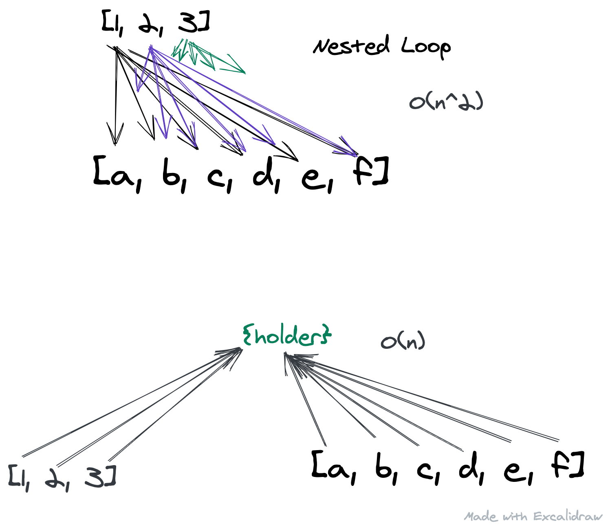

This will be a post on how to use an {} as a hash map.
We will look at how to be more efficient if you find yourself looping in an array, within an array, by leveraging the javascript object.

# Hash Map

As I learned development, I heard the phrases 'hash-map' 'hash' 'hash-table' thrown around, and generally had no idea what anyone was referring to. As someone who's first language was javascript, which basically has the object <strong>{}</strong>, I nodded but wasn't really sure what they were talking about.

Even when I would see a solution to a coding challenge implementing a solution, I wasn't too sure what I was looking at. So for those of you looking for the plain and simple...
<br/>

 
<strong> <em>A hash-map is something that has key's and values, so for JS dev's think object{}.</em></strong>

If you've been using objects then you can do this.They come up as a great way to access data because we can access the value directly by calling the object.key. These come up sometimes in Coding Challenges, especially if you find yourself writing a nested loop. 

 Let's look at a problem to see it in action.

## Two Sum
___
<em>(Credit <a href='https://leetcode.com/'>leetcode</a> for this problem on their site)</em>

Given an array of integers nums and and integer target, return the indices of the two numbers such that they add up to target.

You may assume that each input would have exactly one solution, and you may not use the same element twice.

You can return the answer in any order.
They then give an example of an input of <strong>nums</strong> and <strong>target</strong>.

```javascript
nums = [2, 4, 3, 6, 9]
target = 10
```

So we need to check which combo of numbers adds to the target 10. In this case it's `4` and `6`, so we would return `[1, 3]` the indices of those values. 
___
So what did we do in our heads just then?


### Approach 1
You might say we quickly checked is 2 + 4 = 10?, is 2+3 = 10?, is 2+6 = 10? ..., is 4+3 = 10?, is 4+6 = 10? (yes).


### Approach 2
You might also have looked at each number and thought about what value would you add to get to the target? In other words if I have 2, I would need to add 8 to get to the target. If I have 4, I would need 6 to get to the target...

### Approach 1
The first way to approach this ends up being a nested loop if we approach it programatically. The solution follows below. If you would like to try it first, don't click on the selection below.

  
```javascript
  var twoSum = function(nums, target) {
    for (let i = 0; i < nums.length-1; i++) {
        for (let j = i+1; j < nums.length; j++) {
            if (nums[i] + nums[j] === target)
                return [i,j];
        }
    }
  };
```

This is a legit solution and shouldn't be shrugged off, but if you have a loop nested in another loop, you are looking at time complexity of O(n<sup>2</sup>) and we can do better. Getting this solution is a good idea to begin with, then you can worry about optimizing.


### Approach 2
The other way - that is, thinking about what each value needs in order to add up to the target uses what we could call a hash-map. First we can save all the nums as properties in an object. I like to call mine holder.

```javascript
var twoSum = function(nums, target) {
  //define an object holder
  const holder = {}
  for (let i=0; i < nums.length; i++) {
    //assign object keys as we loop through
    //we give it the value of the index bc we will need it
    holder[nums[i]] = i
  } 
```

So at this point we now have the first value accessable as a key in the object. We can now loop through again, and this time, check if our object key and our num sum up to the target. This matches up with the second way of looking at the list. In other words, if I have a 2 and the target is 10, do I have an 8? We check our object for that key of 8.

```javascript
var twoSum = function(nums, target) {
  //define an object holder
  const holder = {}
  for (let i=0; i < nums.length; i++) {
    //assign object keys as we loop through
    //we give it the value of the index bc we will need it
    holder[nums[i]] = i
  } 
  //loop again
  for (let i=0; i < nums.length; i++) {
    //we take the difference btwn each num and the target
    //this will give us the value we need to add up to the target

    let value = target - num[i]
    
    //if we have a property on our object w/ the value
    //then they will add to the target

    if (holder[value] && holder[value] !== i) {
      //that second condition was to make sure each index is unique
      return [holder[value], i]
    }
```


<fig>(visual showing hashmap efficiency vs nested loops)</fig>

Even though we write two loops here, they are not nested, and so are much more efficient. It's an O(2n) situation which we just call O(n). This is one use case, it definitely doesn't cover every situation, and I don't think you could cover every situation. Hopefully this gives you some idea of how you could make a has-map to help solve a problem more efficiently.

As a parting gift, here's another coding challenge to try out. Given two arrays,arr1, arr2, check if one is a subarray, and if so return true, else return false.
```javascript
Input:
arr1 =['hey', 'what', 'is', 'up', 'with' 'hashmap']
arr2 =['hashmap', 'is', 'what', 'up']
return >> true. arr2 is a subarray of arr1.
```

Happy coding,

James

