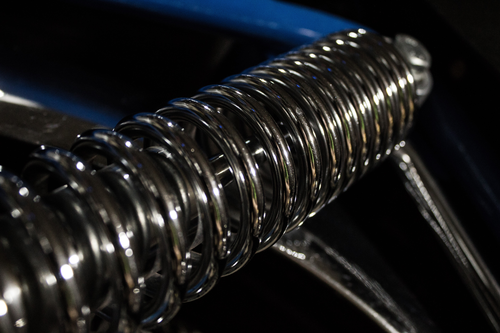

This project was bootstrapped with [Create React App](https://github.com/facebook/create-react-app).
It was inspired by Tesla's site, and is only an homage, it is not meant to sell or compete in any way shape or form with Tesla

# A practice in using react-spring
# tesla-summer

In this walkthrough we will animate our page with the library <a href='https://www.react-spring.io/docs/hooks/use-transition'>`react-spring`.</a>


Let's start with the code on this sandbox.<a href='https://codesandbox.io/s/summer-tesla-forked-c1h8l'>summer-tesla-forked</a> You can fork this and work along. If you would like to see the final product, you can go to the link <a href='https://codesandbox.io/s/summer-field-tesla-ksqzj'>here</a>.
```javascript
cd tesla-summer
npm i
npm i react-spring

```


### 1. Our app right now. Returns content as is, no animation yet
## Ok - react-spring time
### 2. useSpring
  The 'react-spring' library has a number of different hooks we could use. We will be going with <strong>`useSpring` </strong> and <strong>`useChain`</strong>. The useSpring hook gives us a chance to configure some styles, while the useChain gives us a chance to decide how to run those animation styles. We will only set the time on the first animation, then we will make a <strong>useChain</strong> that references the previous animation and runs after it.

At the top of our App.js lets bring in what we need from the react-spring library
```javascript
  // App.js
  import React from 'react'
  import { useSpring, animated, useChain } from "react-spring";
```

Now down in the App function, lets define our spring by calling the useSpring hook. We define what our animation should do, it comes <strong>from</strong> somewhere and goes <strong>to</strong> somewhere else.
```javascript
export default function App() {
  const springName = useSpring({
    delay: 1000,
    from: {opacity: 0, paddingTop: '20vh'},
    to: {opacity: 1, paddingTop: '10vh'}
  });
```

We can define whatever properties we want in the `from` and `to` objects. Notice the camelCase css writing, also we use `,` after each property instead of a `;`. Then using spring physics based animation, our elements will change from one to the other on entry.

### 3. Wrap a componenent in animated
We pass the spring in as a set of style properties in the animated.div
```javascript
// wrap our CarName component in an animated div
  return(
        <Nav />
        <animated.div style={springName}>
          <CarName />
        </animated.div>
        <Specs />
```
### 4. Let's check it out
  Lets go ahead and wrap the other two components `<Specs />` and `<Buttons />` in animated.divs as well. Then let's check our result and look back at what we are trying to get to.

### 5. Different animations going on
  Just like you can use `useState` multiple times, you can also use `useSpring` multiple times. So lets make another two springs called specsSpring and buttonsSpring. You give it a try first, yours may end up better than mine.

```
const specsSpring = useSpring({
    from: {opacity: 0,  transform: 'translateX(100px)'},
    to: {opacity: 1,  transform: 'translateX(0px)'},
  });
  const buttonSpring = useSpring({
    from: {opacity: 0},
    to: {opacity: 1}
  });
```

### 6. Now wrap those components with animated.divs
At this point we should get 3 parts of our page animating. But they don't have that staggered feeling. The first one has a delay of 1sec, but the other ones just fire off. We could try and put a better delay to time them after the first, but react-springs has a custom approach.

### 7. Enter useChain()
useChain accesses the useRef from 'react'. It allows it to watch until an animation has finished, and then you can set off the next one. We will update our 3 springs, to each have a different ref. First though we need to import {useRef} from 'react'
```
// at the top of App.js
import React, {useRef} from 'react'
import { useSpring, animated, useChain } from "react-spring";
```
Now we update each spring to have a ref, here's how the first one will look.
```javascript
export default function App() {
  const refOne = useRef()
  const springName = useSpring({
    ref: refOne,
    delay: 1000,
    from: {opacity: 0, paddingTop: '20vh'},
    to: {opacity: 1, paddingTop: '10vh'}
  });
```
Similarly we define a new ref for the next two, and then before we return our JSX, we decide what order we want our animations to play out in. We will create an array or refs, and then with useChain, we will animate in that order.
```javascript
  // put this before the return block
  useChain([refOne, refTwo, refThree]);
```
After this, our animations should wait until the previous one is finished and then run the next one in the <em>chain</em>. This is a nice natural feel, to having animations play out on the page. Speaking of natural, one of the coolest things about react-spring is being able to customize it.

## 8. config
#### The real thing that got me Hooked on 'react-spring'
  Besides just using `to` and `from` in out trail, we can also `config` the physical properties of our animated elements. What!!!? Normal CSS transitions can be defined linear, or cubic-bezier, or any number of ways, but with react-spring we get an animation that acts as a physical object would when interacting with a spring. 

It's a little bit cool, lets play around. Within our `useSpring`, we will `config` some of these properties.

```javascript
{/*
// in our useSpring()
...
to {
  //ending properties
}
config: { mass: number, friction: number, tension: number, clamp: true or false }
});
*/}
```
### Done. useSpring, useSprings, useChain, useTransition, useTrail
There is a lot more you can do with this. I suggest looking at their [examples](https://www.react-spring.io/docs/hooks/examples), and then just altering values until you get a good sense of what everything is doing. Hope you can find a use for this somewhere down the line.
