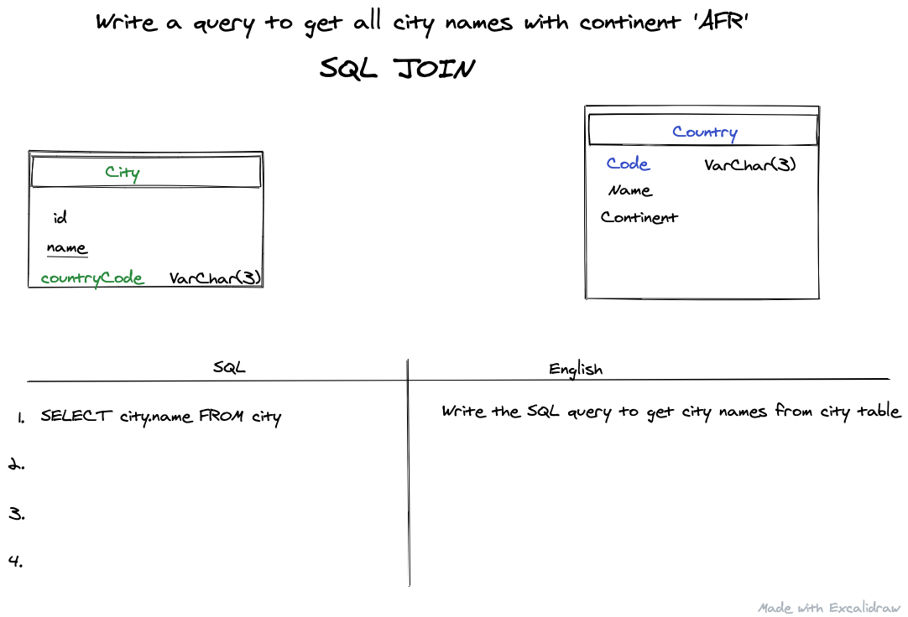
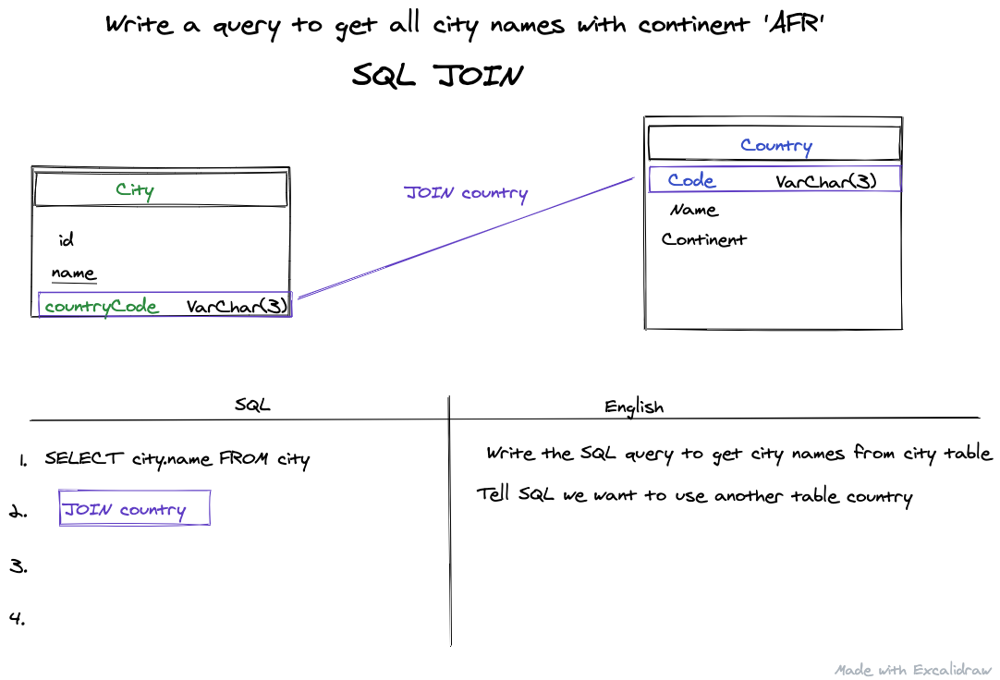
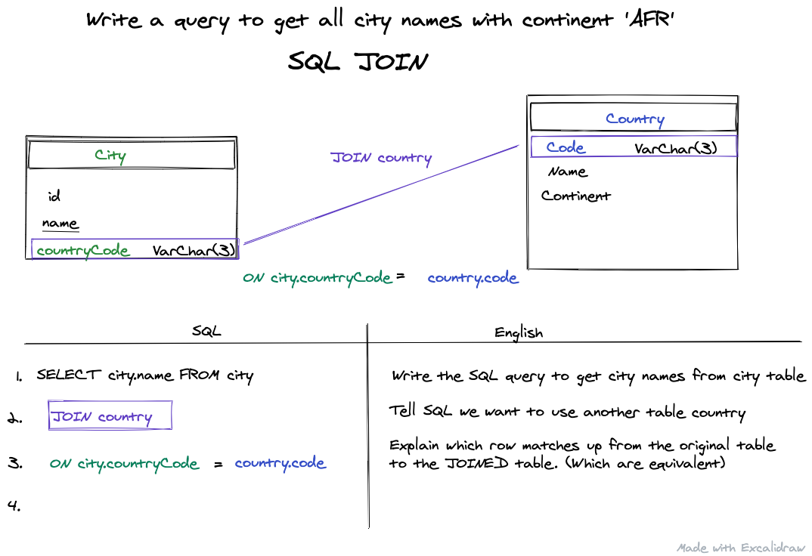
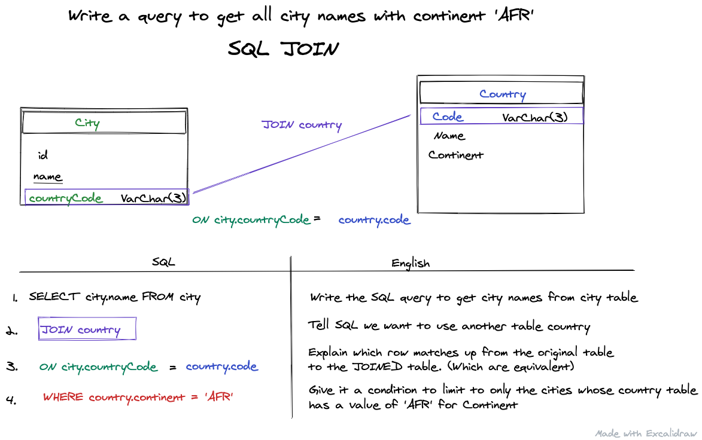

# Basic SQL JOIN

So you have some tables in SQL with a relationship between them, and you want to return something from one table, but based on a condition in another. Great! `JOIN`

As always, I think it is best to talk about this by looking at an example. We are going to borrow a problem close to one I found on <a href='hackerRank'>hackerRank</a> the other day. Basically you had a <em>city</em>, and a <em>country</em> table. 

The <em>city</em> table does have a row <strong><em>countryCode</em></strong>, which matches up with the <strong><em>code</em></strong> row in the <em>country</em> table. This is a referred to as a <strong>Foreign Key</strong> when it is in the City table, and a <strong>Primary Key</strong> when it is in it's own table <em>country</em>.

#
### Task : Write a query to get all cities w/ continent of 'AFR'


#

### Step 1: SELECT statement
So given these two tables, if you've never done a join before, I want you to think about just the first part of this question.

#### Write a query to get all cities
Well, this first part is the same as it would be if we only had one table. So don't worry about the other table yet, lets just write the first part
```
SELECT * FROM city
```


### Step 2. JOIN statement

We need to reference the other table Country even though we are not returning anything from it. Since our `WHERE` will be dependent on a row within it, we need to `JOIN` it to get access.

```
JOIN country
```
Done.


Step 3. ON
Ok not really done... SQL is pretty great, but you still need to explain how you are joining these, so we need to explain the two keys that match up between these tables.

#### Write a equality statement for the two rows that match up

```
ON city.countryCode = country.code
```


### Step 4. WHERE
Now that we have JOINED the <em>country</em> table we can use WHERE like we normally would. At this point I generally imagine that I've created a super table. 



In reality we haven't. Since it would be really inefficient to have each city entry with all this data unless we really needed it. But we can act like we did. And make our selection based only on those countries within Africa.
```
WHERE country.continent = 'AFR'
```
#
Alright, thats a solid basic JOIN between two different tables with a One-to-Many relationship
Total block of code would be 

```
SELECT city.name FROM city
JOIN country
ON city.countryCode = country.code
WHERE country.continent = 'AFR'
```

Go find a couple basic SQL JOIN challenges and try it out.

Happy coding,

James
