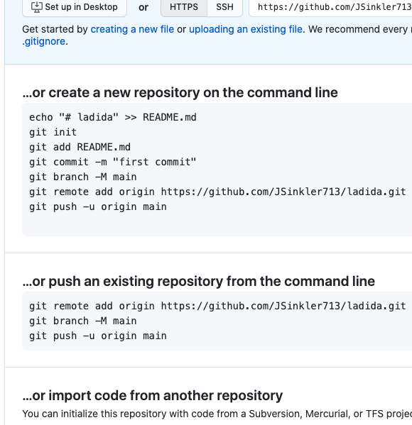

<em>Progress forward</em><br/>
<span>Photo by <a href="https://unsplash.com/@veklabs?utm_source=unsplash&amp;utm_medium=referral&amp;utm_content=creditCopyText">Vek Labs</a> on <a href="https://unsplash.com/s/photos/forward?utm_source=unsplash&amp;utm_medium=referral&amp;utm_content=creditCopyText">Unsplash</a></span> 

So recently gitHub has changed it's structure from the default naming  of the 'master' branch to 'main'. I am embracing this change to unneccesary referring to a master-slave relationship as soon as possible. My local git version does not have this update yet by default, and so I will be showing how to change your local .gitconfig to reflect all new github branches to have the branch `main` to start with.

Although some developers may see this as unneccessary, and a complication. I think this is the right move going forward. Doing things in the same way, simply because that's how it was done, is no way forward in society. Ok let's get to it.


## Github directions currently


This line below is the **main** 👀 part of the above steps...
```
git branch -M main
```

Here gitHub is assuming you are on branch `master`, and are going to do a **merge** from the current branch to main. To be more specific we could pass in two arguments, both the branch we want to change and the new branch.
```
git branch -M oldBranchToChange newBranchToChangeTo
git branch -M master main
```

Doing the above step will work to merge into a new branch main, but let's just start with `main` as the default. In time, the git community will most likely make the below steps irrelevant, but let's not wait for change.


Instead we change our `.gitconfig`. Our `.gitconfig` probably has info about our user, and maybe some other things as well in there. So instead of having to do this for each new repo, we will start out on our main branch. We can then add our remote and push up without the step to merge.


We can edit our config directly or run a command from our terminal to access it. To edit it directly, if you run a `ls -a` from your home, you should see a `.gitconfig` file. Open it with your text editor of choice.


Inside underneath whatever user we will add the following lines
```
#inside out .gitconfig
[init]
	defaultBranch = main
[alias]
	new = !git init && git symbolic-ref HEAD refs/heads/main
```
For me, the first line `defaultBranch = main` is not actually doing anything. If your git is sufficiently up to date it could though. I think 2.28 or higher. The second alias is for me what is working. It will point the HEAD to `main`, instead of the default `master` when I initialize a new git repo.

If you just want to run a command from the terminal to do the ** exact same** as the above step.
Simply run
```
git config --global alias.new '!git init && git symbolic-ref HEAD refs/heads/main'
```


<em>Look at our old withered branch `master` in the snow...</em>✌️<br/>
<span>Photo by <a href="https://unsplash.com/@fstopusa?utm_source=unsplash&amp;utm_medium=referral&amp;utm_content=creditCopyText">Stephen Ellis</a> on <a href="https://unsplash.com/s/photos/tree-branch?utm_source=unsplash&amp;utm_medium=referral&amp;utm_content=creditCopyText">Unsplash</a></span>


Just make sure to close your terminal after the fact, and the next time you run a `git init` you should be on branch main. Now when adding a remote and pushing to github you'll just need to:
```
git remote add origin https://github.com/awesomeTyper/vimRepo.git
git push -u origin main
```

Happy coding,

James
